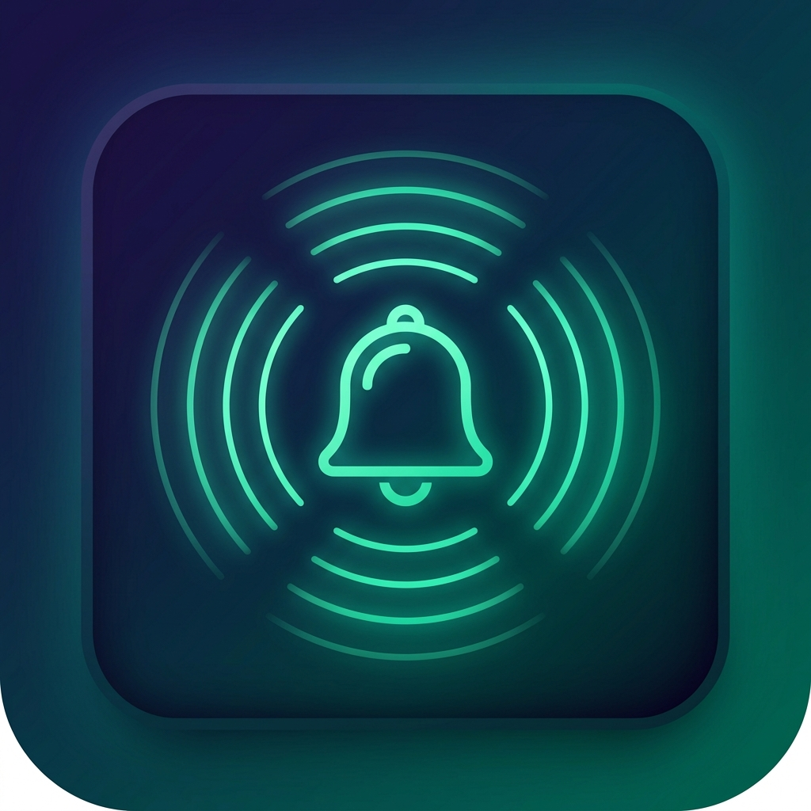

# ZenPulse — Soothing Interval Beep PWA

ZenPulse is a mindful, aesthetic Progressive Web App (PWA) designed to play a gentle, soothing chime every 10 seconds (or any customizable interval). Built for meditation, focus, pacing, physical therapy, eye rests, and mindfulness.



## ✨ Features

- **Soothing Acoustic Chimes (Web Audio API)**:
  - 🧘 **Tibetan Singing Bowl**: 432 Hz warm harmonic resonance with gentle natural decay.
  - 🔔 **Zen Chime (528 Hz)**: Crystalline, peaceful Solfeggio bell.
  - ✨ **Soft Ambient Sine**: 440 Hz ultra-gentle pure tone with zero click.
  - 🍃 **Forest Cascade**: Peaceful dual-tone temple chime.
  - 🌊 **Deep Mindfulness Gong**: 216 Hz grounding low harmonic tone.
- **Interval Control**:
  - Defaults to **10 seconds** with visual circular countdown ring.
  - Quick-preset chips: `5s`, `10s`, `15s`, `30s`, `1m`, `5m`, or custom slider.
- **Visual Pulse & Breathing Guide**:
  - Concentric glowing ripples synced with each chime.
  - Inhale / Exhale guidance to pace your breath.
  - Soundwave visualizer bars.
- **Progressive Web App (PWA)**:
  - 100% offline capable via Service Worker.
  - Installable directly to your Home Screen on iOS, Android, macOS, and Windows.
- **Background & WakeLock Support**:
  - **Screen Wake Lock API**: Keeps display awake while timer is running.
  - **Silent Audio Buffer Keepalive**: Keeps Web Audio running on mobile browsers without throttling.
- **Keyboard Shortcuts**:
  - <kbd>Space</kbd>: Start / Pause
  - <kbd>T</kbd>: Test chime sound

---

## 🚀 How to Deploy to GitHub Pages (2 Easy Options)

### Option 1: Automatic Deployment via GitHub Actions (Recommended)

1. Create a new repository on [GitHub](https://github.com/new) (e.g. `soothing-beep-pwa` or `zenpulse`).
2. Push this folder to GitHub:
   ```bash
   git init
   git add .
   git commit -m "Initial commit of ZenPulse PWA"
   git branch -M main
   git remote add origin https://github.com/<YOUR-USERNAME>/<YOUR-REPO-NAME>.git
   git push -u origin main
   ```
3. In your GitHub repository:
   - Go to **Settings** > **Pages**.
   - Under **Build and deployment** > **Source**, select **GitHub Actions**.
4. The workflow in `.github/workflows/deploy.yml` will automatically build and publish your PWA at:
   `https://<YOUR-USERNAME>.github.io/<YOUR-REPO-NAME>/`

---

### Option 2: Classic GitHub Pages (`Deploy from a branch`)

1. Push the code to the `main` branch.
2. In your repository on GitHub, go to **Settings** > **Pages**.
3. Under **Build and deployment** > **Source**, select **Deploy from a branch**.
4. Choose the `main` branch and `/ (root)` folder, then click **Save**.
5. Your app will be live within 1–2 minutes!

---

## 📱 How to Install on Your Device

- **iOS / Safari**: Open your GitHub Pages link, tap the **Share** button, and tap **"Add to Home Screen"**.
- **Android / Chrome**: Tap the banner or open the menu (three dots) and tap **"Install app"** or **"Add to Home screen"**.
- **Desktop (Chrome / Edge)**: Click the **Install** button in the app header or address bar.

---

## 💻 Local Testing

You can preview the app locally using any static web server:

```powershell
# Using Python:
python -m http.server 8080

# Or using npx:
npx serve .
```
Then open `http://localhost:8080` in your browser.
